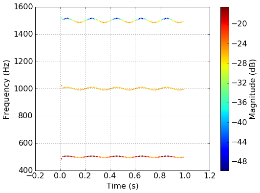

# PyPeVoc

*PyPeVoc* is a simple Phase Vocoder library intendend mostly to analysis of sounds. It aims to be flexible and easy to adapt, and is thus entirely written in Python, rathe than using some components in C, which would make it faster but harder to maintain.

Unlike other Phase vocoders, *PyPeVoc* keepsthe phase information of each sine wave, so that resynthesised waveforms match the original as close as possible. Other Phase Vocoders nly keep magnitude information. This is not a problem for the sound, but it is for analysis. 

## Phase Vocoder

***Phase Vocoding*** is a technique of decomposing a periodic sound into its ***quasi-sinusoidal*** components. These are sinewaves that have slowly-varying frequency and amplitude. 

Sine-wave decomposition allows a wide-range of analysis and resynthesis techniques, exemplified in the Wiki (soon to come) 

## Example situation

### Import required libraries

```python
import numpy as np
from pypevoc import PV
```

### Create a periodic sound

```python
# Sample rate
sr = 44100

# Vibrato frequency
vibfreq = 5.0

# Average amplitude of harmonics
hamp0 = 0.1*np.array([1, .5, .3])

# Fraction variation of harmonics in vibrato
hvib = 1.0*np.array([.5,0.1,.9])
# relative phase of harmonic variation
hph = np.array([0,np.pi/2,np.pi])
f0 = 500

# Depth of frequency vibrato
f0vib = 0.01

# signal duration
dur = 1.0

# will contain the final sound vector
sig = np.zeros(int(sr*dur)) + 0.01*(np.random.rand(int(sr*dur))-.5)

# time vector
t = np.arange(0, dur, 1./sr)

# vectors for varying properties of the sound 
hvibsig = np.zeros((int(sr*dur), len(hamp0)))
vibsig = np.sin(2*np.pi*vibfreq*t)

f0sig = f0 * (1 + f0vib*vibsig)

for n,ha in enumerate(hamp0):
    hno = n+1
    fsig = f0sig*hno
    phsig = np.cumsum(2*np.pi*fsig/sr)
    hvibsig[:,n] = ha * (1 + hvib[n]*np.sin(2*np.pi*vibfreq*t+hph[n]))
    sig += (hvibsig[:,n]) * np.sin(phsig)

```

### Analyse 

``` python
# creates a Phase vocoder object
mypv = PV(sig, sr, nfft=2048, npks=len(hamp0))

# run the analysis
mypv.run_pv()

# plot the results in a time-frequency graph
mypv.plot_time_freq()
```

### Result


